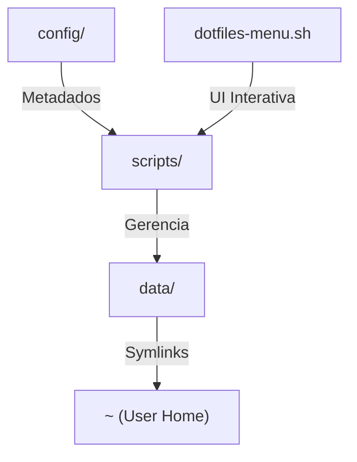

# ⚙️ Dotfiles Manager

> Gestão inteligente e modular de configurações pessoais utilizando symlinks, scripts de automação e uma interface de menu interativa.


---

## 🏗️ Arquitetura do Sistema

O projeto utiliza uma abordagem de **Fonte da Verdade** em `data/`, projetando os arquivos para a Home do usuário através de symlinks inteligentes.



## 📂 Estrutura de Diretórios

| Caminho | Propósito |
| :--- | :--- |
| `data/` | **Fonte da Verdade**: Arquivos reais de configuração. |
| `config/` | Listas de controle (`dotfile-names.list`, `packages.list`). |
| `scripts/` | Core logic, UI do menu e scripts de instalação. |
| `docs/` | Documentação técnica aprofundada e notas. |

## 🚀 Quick Start

### 1. Clonar o Repositório
```bash
git clone https://github.com/ogutierrezmax/dotfiles.git ~/dotfiles
cd ~/dotfiles
```

### 2. Instalação Completa (Batch)
Para vincular todos os arquivos listados de uma só vez:
```bash
./scripts/install-dotfiles.sh
```

### 3. Menu Interativo (Gestão Individual)
Para visualizar o estado de cada link e gerenciar manualmente:
```bash
./dotfiles-menu.sh
```

## 🛠️ Como Adicionar Novos Dotfiles
A maneira recomendada de adicionar novos arquivos é através do menu interativo, que automatiza a importação e criação de links:

1. Execute o menu: `./dotfiles-menu.sh`
2. Digite o comando: `add .nome-do-arquivo` ou o caminho completo (ex: `add .zshrc` ou `add ~/.ssh/config`)
3. O menu converterá caminhos para nomes relativos, detectará se o arquivo existe na sua Home e oferecerá para importá-lo automaticamente.

> [!TIP]
> Você também pode gerenciar remoções com `rmN` (ex: `rm3`) e realizar commits inteligentes com o comando `commit` dentro do menu.

---

## 📖 Documentação de Ferramentas

Confira os guias detalhados sobre as ferramentas gerenciadas por estes dotfiles:

- [🪟 Tmux (Terminal Multiplexer)](./docs/tmux.md): Configuração de persistência e plugins.

## 🤖 AI Context
Este repositório é **AI-Ready**. Agentes de IA podem encontrar um mapa completo do sistema em [llms.txt](./llms.txt).
