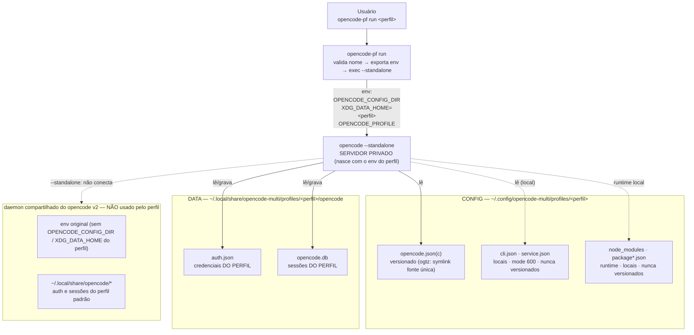

# 📐 Diagrama de Arquitetura — Isolamento por Perfil

> Como o `opencode-pf` expõe a cada perfil apenas a sua config/dados, iniciando
> um **servidor privado** (`--standalone`) em vez de conectar no daemon
> compartilhado do opencode v2.

## Leitura do diagrama

| Elemento | Significado |
| :--- | :--- |
| **Linha sólida para config/dados** | O servidor privado lê/grava **somente** o que está dentro do perfil |
| **Linha tracejada para `cli.json`/`service.json`/runtime** | Existem locais (por perfil), mas são sensíveis/gerados — nunca versionados |
| **Tracejado `--standalone` → daemon** | O que o **bug #3** do `opencode-multi` fazia era conectar nesse daemon; o correto é **não** conectar (servidor privado) |
| **`DAE` (daemon compartilhado)** | Continua servindo sessões do perfil padrão (env original) — não é tocado pelos perfis |

## Por que XDG_DATA_HOME é o ponto crítico

O opencode v2 resolve o diretório de dados como `$XDG_DATA_HOME/opencode`. O
`opencode-multi` setava `XDG_DATA_HOME` no **pai** dos perfis
(`.../profiles/`), então todos os perfis resolviam o mesmo
`.../profiles/opencode/` (bug #1). O `opencode-pf run` aponta
`XDG_DATA_HOME` para o **próprio perfil** (`.../profiles/<perfil>`), fazendo o
opencode resolver `.../profiles/<perfil>/opencode/` — auth e sessões ficam
**isolados por perfil**.

---
*Diagrama gerado durante o onboarding do opencode-profiles nos dotfiles.*