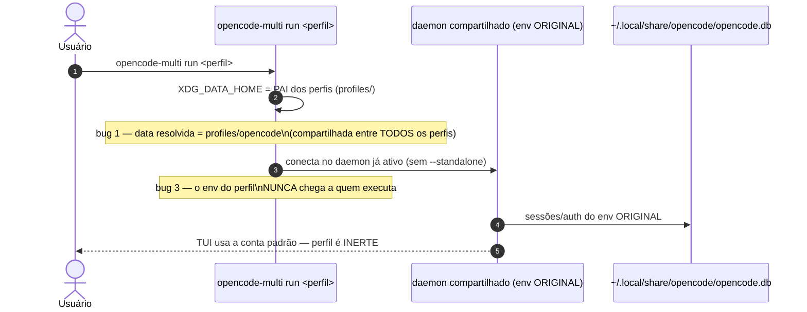
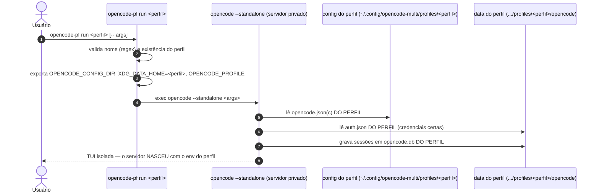

# 📐 Diagrama de Sequência — `run`: fluxo quebrado × fluxo corrigido

> O mesmo comando "rodar um perfil" — antes (`opencode-multi`, quebrado no
> opencode v2) e depois (`opencode-pf`, corrigido).

## Fluxo quebrado — `opencode-multi run <perfil>`

## Fluxo corrigido — `opencode-pf run <perfil>`

## O que muda entre os dois fluxos

| # | `opencode-multi` (quebrado) | `opencode-pf` (corrigido) |
| :- | :--- | :--- |
| 1 | `XDG_DATA_HOME` aponta para o **pai** (`profiles/`) → data compartilhada | Aponta para o **próprio perfil** (`profiles/<perfil>`) → data privada |
| 2 | — | `auth.json` lido do lugar **certo** (`<perfil>/opencode/auth.json`) — era o bug #2 (auth órfã na raiz do perfil) |
| 3 | Conecta no **daemon compartilhado** (env original) | Sobe **servidor privado** com `--standalone` — o env do perfil chega ao processo que executa |

---
*Diagrama gerado durante o onboarding do opencode-profiles nos dotfiles.*